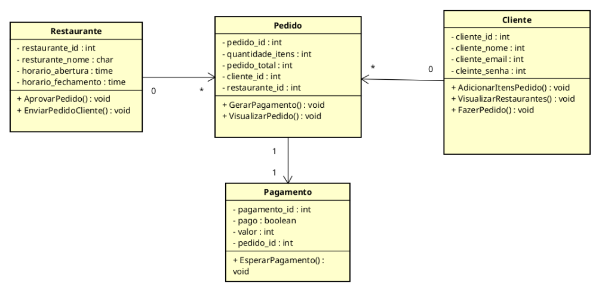

# TremBom - Plataforma de Serviços de Entrega

## 🚀 Visão Geral do Projeto

O **TremBom** é uma plataforma de serviços de entrega desenvolvida para criar uma ponte eficiente entre **restaurantes parceiros** e **clientes**. O objetivo é simplificar a experiência de pedido e entrega de alimentos, oferecendo uma solução intuitiva.

## ✨ Funcionalidades Principais 

* **Gerenciamento de Restaurantes:** Cadastro, atualização de cardápios e gerenciamento de pedidos.
* **Experiência do Cliente:** Busca por restaurantes, navegação de cardápios, realização e acompanhamento de pedidos.
* **Processamento de Pedidos:** Fluxo otimizado desde a criação até a entrega.
* **Integração de Pagamentos:** Sistema de pagamento seguro e eficiente.

## 🏗️ Arquitetura do Sistema

A estrutura fundamental do TremBom é representada pelo seguinte Diagrama de Classes:



### Descrição das Entidades e Relacionamentos

Detalhes sobre as principais tabelas e suas relações:

* **Cliente:** Um `Cliente` pode efetuar zero ou muitos `Pedidos`.
* **Restaurante:** Um `Restaurante` pode aceitar zero ou muitos `Pedidos`.
* **Pedido:** Cada `Pedido` é associado a um único `Pagamento`.

## Para rodar o projeto 

### Pré-requisitos

- Node.js
- Mongo DB

### Comandos

Entre nas pasta backend e rode o comando abaixo: 

```sh
node app.js
```

## 🤝 Colaboradores

Este projeto foi desenvolvido por:

* **Brena dos Santos Freitas** - Matrícula: 2465710
* **Heitor da Piedade Ferreira** - Matrícula: 2465744

---

**Interessado em saber mais sobre o desenvolvimento ou futuras atualizações?** Fique à vontade para entrar em contato!
